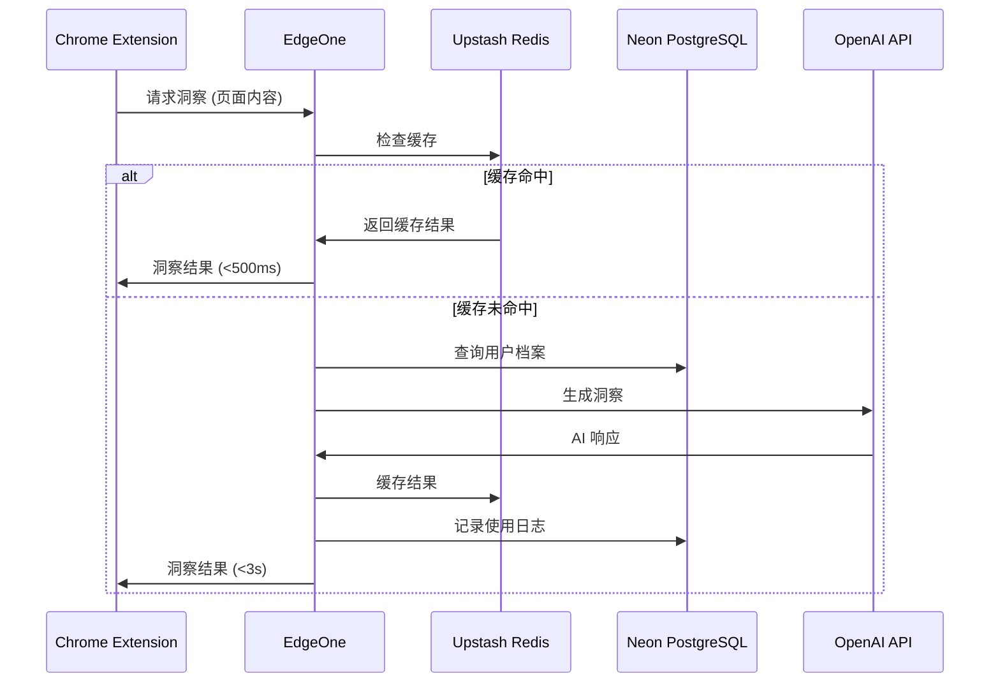
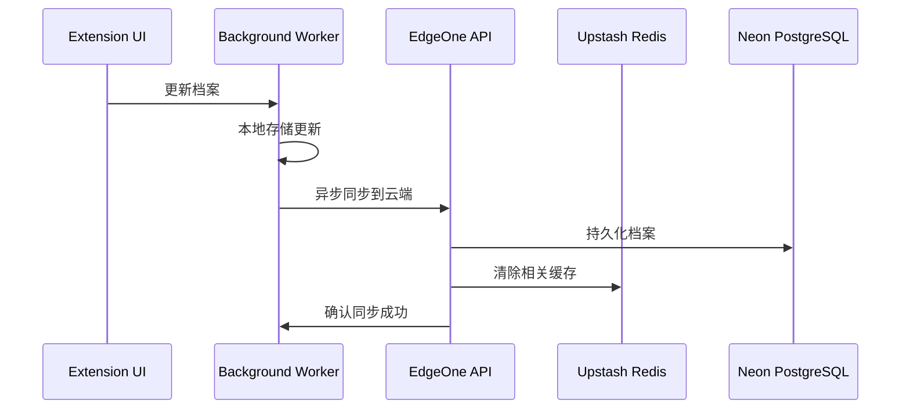

基于你的 ContextMe 概念和技术需求，让我来分析 MVP 的架构设计：

## MVP 核心功能（KISS 原则）

**最小可行版本应该只做一件事：让用户在浏览任何网页时，基于个人档案获得即时的个性化洞察。**

核心流程：
1. 用户设置一次个人档案（背景、兴趣、目标）
2. 插件检测页面内容
3. 基于用户档案生成个性化解释/建议
4. 以非侵入式的方式展示洞察

## 技术架构建议

### 前端：Chrome Extension
- **Manifest V3** （未来兼容性）
- **Content Script** + **Background Service Worker**
- **React** 用于 popup 和设置页面
- 本地存储用户档案（隐私优先）

### 后端：Next.js (推荐)
**为什么选择 Next.js：**
- Edge Runtime 支持，完美配合腾讯 EdgeOne
- API Routes 简化后端逻辑
- Vercel 生态与 EdgeOne 兼容性好
- TypeScript 支持，易维护和扩展
- 中间件支持，便于认证和限流

### 数据库：多层存储策略

**EdgeOne 兼容方案：**

1. Upstash Redis (边缘缓存) - 无服务器，全球分布
2. Neon PostgreSQL (主数据库) - 无服务器，自动扩缩容
3. 混合方案：Upstash Redis + Neon PostgreSQL

## MVP 架构图

```
Chrome Extension
├── Content Script (页面注入)
├── Background Worker (API 调用)
└── Popup (用户设置)
        ↓
EdgeOne CDN
        ↓
Next.js API (Edge Runtime)
├── /api/analyze (内容分析)
├── /api/profile (用户档案)
└── /api/insights (生成洞察)
        ↓
数据层
├── Upstash Redis (边缘缓存)
├── Neon PostgreSQL (持久化)
└── OpenAI API (AI 处理)
```

## YAGNI 原则 - 暂不实现

- 用户注册/登录（先用本地存储）
- 复杂的个性化算法（先用 prompt engineering）
- 多语言支持
- 移动端
- 详细的使用统计
- 社交功能

## SOLID 原则体现

- **单一职责**：每个 API endpoint 只处理一种请求
- **开闭原则**：插件接口设计允许增加新的洞察类型
- **里氏替换**：AI 提供商可替换（OpenAI → 其他模型）
- **接口隔离**：前端只依赖必要的 API
- **依赖倒置**：数据层抽象，便于切换存储方案

## 部署建议

**EdgeOne 部署优势：**
- 全球 CDN 加速
- 边缘计算降低延迟
- 与腾讯云服务集成度高
- 成本相对较低

**推荐部署方案：**
静态资源：EdgeOne CDN
API：EdgeOne Edge Functions
数据库：Neon PostgreSQL (无服务器)
缓存：Upstash Redis (边缘分布)
域名：EdgeOne 域名管理

## MVP 开发优先级

1. **Week 1-2**: Chrome 插件基础框架 + 本地用户档案
2. **Week 3-4**: Next.js API + 基础 AI 集成
3. **Week 5-6**: 内容解析 + 洞察生成
4. **Week 7-8**: EdgeOne 部署 + 性能优化

# ContextMe MVP 详细架构方案

## 系统模块划分

### 1. Chrome Extension 模块

**1.1 Content Script Module**
- **Scope**: 页面内容检测、DOM 操作、洞察展示
- **职责**:
  - 检测页面加载完成
  - 提取页面关键内容（标题、描述、关键词）
  - 注入洞察 UI 组件
  - 处理用户交互（展开/收起洞察）
- **数据流**: 页面内容 → 内容提取 → Background Script

**1.2 Background Service Worker**
- **Scope**: API 调用、数据缓存、跨页面状态管理
- **职责**:
  - 管理与后端 API 的通信
  - 缓存用户档案和最近的洞察结果
  - 处理认证状态
  - 管理请求队列和重试机制
- **数据流**: Content Script ↔ Background Worker ↔ Backend API

**1.3 Popup/Options Module**
- **Scope**: 用户档案设置、偏好管理
- **职责**:
  - 用户档案 CRUD
  - 插件开关和设置
  - 使用统计展示
- **数据流**: 用户输入 → 本地存储 → Background Worker

### 2. Backend API 模块

**2.1 Content Analysis Service**
- **Scope**: 页面内容理解、关键信息提取
- **职责**:
  - 清洗和结构化页面内容
  - 识别内容类型（课程、工作、产品等）
  - 提取关键实体和概念
- **API**: `POST /api/analyze`

**2.2 Profile Management Service**
- **Scope**: 用户档案存储、版本管理
- **职责**:
  - 用户档案的持久化存储
  - 档案变更历史追踪
  - 档案有效性验证
- **API**: `GET/PUT /api/profile`

**2.3 Insight Generation Service**
- **Scope**: AI 驱动的个性化洞察生成
- **职责**:
  - 结合用户档案和内容分析生成洞察
  - 管理 AI 模型调用
  - 结果质量评估和过滤
- **API**: `POST /api/insights`

**2.4 Cache Management Service**
- **Scope**: 智能缓存、性能优化
- **职责**:
  - 洞察结果缓存策略
  - 缓存失效管理
  - 热点内容预计算

### 3. 数据存储模块

**3.1 Redis Cache Layer**
- **Scope**: 会话数据、热点缓存、实时状态
- **数据结构**:
  ```
  user_session:{userId} -> 用户会话信息
  content_cache:{contentHash} -> 内容分析结果缓存
  insight_cache:{userId}:{contentHash} -> 个性化洞察缓存
  rate_limit:{userId}:{endpoint} -> API 限流计数
  ```

**3.2 PostgreSQL Persistent Layer**
- **Scope**: 用户档案、使用统计、长期数据
- **核心表结构**:
  ```
  users: 基础用户信息
  profiles: 用户档案详情（JSON 字段）
  usage_logs: 使用记录和统计
  content_fingerprints: 内容指纹和分类
  ```

## 详细数据流设计

### 主要数据流：用户浏览 → 获取洞察

```
1. 页面加载触发
   Content Script 检测 → 提取页面内容 → 生成内容指纹

2. 缓存检查
   Background Worker → Redis 查询缓存 → 命中则返回

3. 内容分析（缓存未命中）
   页面内容 → Content Analysis API → Redis 缓存结果

4. 用户档案获取
   Background Worker → 本地存储 → 必要时同步到 PostgreSQL

5. 洞察生成
   内容分析结果 + 用户档案 → Insight Generation API → OpenAI API

6. 结果缓存和返回
   洞察结果 → Redis 缓存 → Content Script 展示

7. 使用统计记录
   异步写入 PostgreSQL usage_logs
```

### 用户档案更新流

```
1. 用户修改档案
   Popup UI → 本地存储更新 → Background Worker

2. 同步到后端
   Background Worker → Profile Management API → PostgreSQL

3. 缓存失效
   Profile Management API → Redis 清除相关缓存

4. 重新生成洞察
   下次浏览时重新计算个性化结果
```

## 数据一致性保证

### 1. 最终一致性模型
- **本地存储优先**: 用户档案以本地存储为准，异步同步到云端
- **缓存失效策略**: 用户档案变更时，主动清除相关缓存
- **版本控制**: 用户档案带版本号，防止并发更新冲突

### 2. 分层一致性策略
```
强一致性层: 用户档案核心字段（PostgreSQL ACID）
弱一致性层: 使用统计、缓存数据（异步更新）
会话一致性: 单次浏览会话内保持数据一致
```

### 3. 冲突解决机制
- **客户端优先**: 本地档案修改优先于云端
- **时间戳仲裁**: 最新修改时间的版本获胜
- **人工干预**: 重大冲突提示用户选择

## 性能优化策略

### 1. 缓存策略

**多层缓存架构**:
```
L1: 浏览器本地存储 (用户档案)
L2: Background Worker 内存 (会话缓存)  
L3: Upstash Redis 边缘节点 (分布式缓存)
L4: EdgeOne CDN (静态资源)
```

**缓存策略**:
- **内容分析结果**: TTL 24小时，内容变更主动失效
- **个性化洞察**: TTL 1小时，档案变更主动失效
- **用户档案**: 永久缓存，变更时失效
- **API 响应**: 边缘缓存 5分钟

### 2. 请求优化

**批量处理**:
- 多个页面元素的洞察请求合并
- 定时批量同步使用统计

**异步处理**:
- 洞察生成异步化，先返回缓存结果
- 使用统计异步写入，不影响用户体验

**请求去重**:
- 相同内容的并发请求去重
- 基于内容指纹的智能合并

### 3. AI API 优化

**成本控制**:
- 智能缓存避免重复调用
- 用户等级限制 API 调用频率
- 内容相似度检测，避免重复分析

**响应速度**:
- 流式响应，边计算边返回
- 预计算热门内容的洞察
- 模型调用超时和降级机制

## 速度性能保证

### 1. 响应时间目标
```
页面洞察展示: < 2秒
缓存命中响应: < 500ms
用户档案更新: < 1秒
API 调用超时: 10秒
```

### 2. 性能监控指标
- **TTFB** (Time to First Byte): API 响应首字节时间
- **缓存命中率**: Redis 缓存效果监控
- **AI API 延迟**: OpenAI 调用平均响应时间
- **用户感知延迟**: 从触发到展示的端到端时间

### 3. 性能优化机制

**预加载策略**:
- 用户滚动时预分析可见内容
- 根据浏览历史预测下一步操作

**降级策略**:
- AI API 超时时返回基础洞察
- Redis 不可用时直接调用 AI
- 网络异常时展示离线提示

**资源优化**:
- 洞察 UI 组件懒加载
- 图片和样式资源 CDN 加速
- API 响应 gzip 压缩

## 扩展性设计

### 1. 水平扩展能力
- **无状态 API**: 支持多实例部署
- 数据库自动扩缩容: Neon PostgreSQL 无服务器特性
- Redis 全球分布: Upstash Redis 边缘网络自动扩展

### 2. 功能扩展接口
- **洞察类型插件化**: 支持添加新的分析维度
- **AI 模型可替换**: 统一的 AI 服务接口
- **内容类型扩展**: 支持新的网站类型适配

### 3. 监控和运维
- **实时性能监控**: 接口响应时间、错误率
- **业务指标监控**: 用户活跃度、洞察质量评分
- **自动告警机制**: 异常情况及时通知
- **日志聚合分析**: 用户行为和系统性能分析

这个架构设计保证了系统的高性能、高可用性和良好的扩展性，同时保持了足够的简洁性来快速实现 MVP。

# ContextMe MVP 开发流程设计

## 开发阶段划分（基于可测试性）

### Phase 1: 基础框架搭建 (Week 1-2)

#### 1.1 Chrome Extension 基础框架
**目标**: 建立插件基础结构和本地数据管理

**开发任务**:
- Manifest V3 配置
- Content Script 注入框架
- Background Service Worker 基础
- 本地存储管理模块

**可测试结果**:
```
✅ 插件成功安装到 Chrome
✅ Content Script 在目标页面正确注入
✅ 用户档案可以通过 Popup 创建和编辑
✅ 数据在浏览器重启后持久保存
✅ Background Worker 与 Content Script 通信正常
```

**SOLID 体现**:
- 单一职责: 每个模块只处理一种功能
- 开闭原则: 插件框架支持后续功能扩展
- 依赖倒置: 通过消息传递解耦各模块

**YAGNI 遵循**: 不实现用户认证、云同步等复杂功能

#### 1.2 Next.js 后端基础架构
**目标**: API 基础框架和数据库连接

**开发任务**:
- Next.js 项目初始化（Edge Runtime）
- Neon PostgreSQL 项目创建和连接配置
- Upstash Redis 账号设置和 REST API 配置
- 基础中间件（CORS、限流、错误处理）

**可测试结果**:
```
✅ API 服务在本地环境启动成功
✅ 数据库连接和基础表创建完成
✅ Redis 连接正常，可读写测试数据
✅ API 健康检查端点返回正确状态
✅ 基础错误处理和日志记录工作
```

### Phase 2: 核心数据流实现 (Week 3-4)

#### 2.1 内容分析服务
**目标**: 实现页面内容提取和基础分析

**开发任务**:
- 页面内容提取算法（标题、描述、关键词）
- 内容指纹生成（去重机制）
- 内容分类基础逻辑
- `/api/analyze` 端点实现

**可测试结果**:
```
✅ 能正确提取主流网站的核心内容
✅ 相同内容生成相同的指纹值
✅ API 能识别基本内容类型（课程/工作/产品）
✅ 内容分析结果结构化且一致
✅ 边界情况处理（空页面、错误页面）
```

**测试用例**:
- TUM 课程页面内容提取
- LinkedIn 职位页面内容提取
- Amazon 产品页面内容提取
- 错误页面和空页面处理

#### 2.2 用户档案管理
**目标**: 完整的用户档案生命周期管理

**开发任务**:
- 用户档案数据模型定义
- `/api/profile` CRUD 端点
- 档案版本控制和冲突解决
- 本地与云端同步机制

**可测试结果**:
```
✅ 档案创建、读取、更新、删除功能完整
✅ 档案数据验证和错误处理
✅ 本地档案优先，云端异步同步
✅ 并发更新冲突正确解决
✅ 档案变更历史可追溯
```

**KISS 体现**: 档案结构简单明了，避免过度复杂的嵌套

### Phase 3: AI 集成与洞察生成 (Week 5-6)

#### 3.1 AI 服务集成
**目标**: 稳定的 AI API 调用和错误处理

**开发任务**:
- OpenAI API 集成封装
- Prompt 工程和模板管理
- AI 调用失败的降级策略
- 成本控制和限流机制

**可测试结果**:
```
✅ AI API 调用成功率 > 95%
✅ 超时和错误情况正确处理
✅ API 调用成本在预算范围内
✅ 不同类型内容的 Prompt 模板工作正常
✅ 降级机制在 AI 不可用时生效
```

#### 3.2 洞察生成服务
**目标**: 高质量的个性化洞察生成

**开发任务**:
- `/api/insights` 端点实现
- 内容分析 + 用户档案结合逻辑
- 洞察质量评估机制
- 结果格式标准化

**可测试结果**:
```
✅ 洞察内容与用户档案相关性高
✅ 洞察格式一致且易于展示
✅ 复杂内容能简化为用户可理解的语言
✅ 相同输入产生稳定的输出
✅ 洞察生成时间 < 5秒
```

**SOLID 体现**:
- 单一职责: AI 调用与业务逻辑分离
- 依赖倒置: AI 提供商可替换设计

### Phase 4: 缓存系统与性能优化 (Week 7-8)

#### 4.1 智能缓存系统
**目标**: 显著提升响应速度和降低成本

**开发任务**:
- Redis 缓存策略实现
- 缓存失效和更新机制
- 多层缓存协调
- 缓存命中率监控

**可测试结果**:
```
✅ 缓存命中率 > 70%
✅ 缓存命中时响应时间 < 500ms
✅ 用户档案更新时相关缓存正确失效
✅ 缓存系统在 Redis 不可用时降级正常
✅ 内存使用在合理范围内
```

#### 4.2 前端洞察展示
**目标**: 优雅的用户界面和交互体验

**开发任务**:
- 洞察 UI 组件设计和实现
- 页面注入和样式隔离
- 加载状态和错误状态处理
- 用户交互优化

**可测试结果**:
```
✅ 洞察在页面上正确显示且不影响原页面
✅ UI 组件在不同网站上样式一致
✅ 加载过程用户体验流畅
✅ 支持展开/收起和详细查看
✅ 移动端兼容性良好
```

### Phase 5: 集成测试与部署 (Week 9-10)

#### 5.1 端到端集成测试
**目标**: 完整数据流的稳定性验证

**测试场景**:
- 新用户完整使用流程
- 高并发情况下的系统稳定性
- 网络异常情况的处理
- 不同类型网站的适配性

**可测试结果**:
```
✅ 端到端用户旅程无阻断
✅ 系统在 100 并发用户下稳定运行
✅ 网络延迟或中断时用户体验可接受
✅ 主流网站类型覆盖率 > 80%
✅ 错误恢复机制工作正常
```

#### 5.2 EdgeOne 部署优化
**目标**: 生产环境的高性能部署

**开发任务**:
- EdgeOne 部署配置优化
- CDN 缓存策略配置
- 监控和告警系统设置
- 性能基准测试

**可测试结果**:
```
✅ API 平均响应时间 < 2秒
✅ CDN 缓存命中率 > 90%
✅ 全球各地区访问延迟可接受
✅ 监控系统正确报告关键指标
✅ 自动扩容和故障转移机制工作
```

## 每阶段的质量保证

### 代码质量标准
```
✅ 单元测试覆盖率 > 80%
✅ ESLint/Prettier 代码规范检查通过
✅ TypeScript 类型检查无错误
✅ 性能测试基准达标
✅ 安全漏洞扫描通过
```

### 用户体验验证
```
✅ 核心功能可用性测试通过
✅ 界面响应速度满足预期
✅ 错误提示信息清晰友好
✅ 数据一致性验证通过
✅ 跨浏览器兼容性测试通过
```

## 开发环境与工具链

### 开发环境设置
- **前端**: Vite + React + TypeScript
- **后端**: Next.js + TypeScript + Prisma ORM
- **数据库**: PostgreSQL + Redis (Docker Compose)
- **测试**: Jest + Playwright + Cypress
- **部署**: Docker + GitHub Actions

### 质量保证工具
- **代码检查**: ESLint, Prettier, Husky
- **测试框架**: Jest (单元测试), Playwright (E2E)
- **性能监控**: Lighthouse, Web Vitals
- **错误追踪**: Sentry
- **API 文档**: OpenAPI/Swagger

这个开发流程确保每个阶段都有明确的、可测试的交付物，同时严格遵循 SOLID、YAGNI、KISS 原则。每个阶段完成后都有清晰的验收标准，便于项目管理和质量控制。你觉得还需要调整哪些部分？


# ContextMe MVP 修订架构方案
*基于 Upstash Redis + Neon PostgreSQL + EdgeOne*

## 修订后的技术栈

### 核心技术选型
- **前端**: Chrome Extension (Manifest V3) + React + TypeScript
- **后端**: Next.js 14 (App Router + Edge Runtime)
- **数据库**: Neon PostgreSQL (无服务器)
- **缓存**: Upstash Redis (边缘缓存)
- **部署**: EdgeOne (腾讯云边缘计算)
- **认证**: NextAuth.js + JWT
- **支付**: Stripe
- **AI**: OpenAI API

### 架构优势
- **零运维**: 所有服务都是无服务器/托管服务
- **全球加速**: EdgeOne + Upstash 边缘网络
- **成本可控**: 免费层充足，按使用量付费
- **开发友好**: 与 Next.js 生态完美集成

## 详细系统架构

### 1. 数据存储分层设计

#### Upstash Redis (L1 缓存层)
```
用户档案缓存: user:profile:{userId} -> JSON (TTL: 1h)
内容分析缓存: content:{contentHash} -> JSON (TTL: 24h)
洞察结果缓存: insight:{userId}:{contentHash} -> JSON (TTL: 1h)
会话管理: session:{sessionId} -> JSON (TTL: 30min)
API 限流: rate_limit:{userId}:{endpoint} -> counter (TTL: 1min)
使用统计: usage:{userId}:{date} -> JSON (TTL: 7d)
```

#### Neon PostgreSQL (持久化层)
```sql
-- 用户基础表
CREATE TABLE users (
    id UUID PRIMARY KEY DEFAULT gen_random_uuid(),
    email VARCHAR UNIQUE NOT NULL,
    stripe_customer_id VARCHAR,
    subscription_status VARCHAR DEFAULT 'free',
    subscription_tier VARCHAR DEFAULT 'basic',
    trial_ends_at TIMESTAMP,
    created_at TIMESTAMP DEFAULT NOW(),
    updated_at TIMESTAMP DEFAULT NOW()
);

-- 用户档案表
CREATE TABLE user_profiles (
    id UUID PRIMARY KEY DEFAULT gen_random_uuid(),
    user_id UUID REFERENCES users(id) ON DELETE CASCADE,
    profile_data JSONB NOT NULL,
    version INTEGER DEFAULT 1,
    created_at TIMESTAMP DEFAULT NOW(),
    updated_at TIMESTAMP DEFAULT NOW()
);

-- 内容指纹表
CREATE TABLE content_fingerprints (
    id UUID PRIMARY KEY DEFAULT gen_random_uuid(),
    content_hash VARCHAR UNIQUE NOT NULL,
    url VARCHAR,
    title VARCHAR,
    content_type VARCHAR,
    extracted_data JSONB,
    created_at TIMESTAMP DEFAULT NOW()
);

-- 使用日志表
CREATE TABLE usage_logs (
    id UUID PRIMARY KEY DEFAULT gen_random_uuid(),
    user_id UUID REFERENCES users(id),
    action_type VARCHAR NOT NULL,
    content_hash VARCHAR,
    tokens_used INTEGER,
    cost_cents INTEGER,
    metadata JSONB,
    created_at TIMESTAMP DEFAULT NOW()
);

-- 订阅表
CREATE TABLE subscriptions (
    id UUID PRIMARY KEY DEFAULT gen_random_uuid(),
    user_id UUID REFERENCES users(id),
    stripe_subscription_id VARCHAR UNIQUE,
    status VARCHAR,
    current_period_start TIMESTAMP,
    current_period_end TIMESTAMP,
    price_id VARCHAR,
    created_at TIMESTAMP DEFAULT NOW()
);

-- 索引优化
CREATE INDEX idx_users_email ON users(email);
CREATE INDEX idx_user_profiles_user_id ON user_profiles(user_id);
CREATE INDEX idx_usage_logs_user_id_created ON usage_logs(user_id, created_at);
CREATE INDEX idx_content_fingerprints_hash ON content_fingerprints(content_hash);
```

### 2. 系统模块重新设计

#### Chrome Extension 模块

**Content Script Manager**
```typescript
// 职责：页面内容检测和 UI 注入
class ContentScriptManager {
  - detectPageContent(): PageContent
  - injectInsightUI(insights: Insight[]): void
  - handleUserInteraction(): void
  - communicateWithBackground(): void
}
```

**Background Service Worker**
```typescript  
// 职责：API 调用和状态管理
class BackgroundWorker {
  - manageAPIRequests(): void
  - handleAuthentication(): void
  - syncUserProfile(): void
  - cacheManagement(): void
}
```

#### Next.js API 模块

**API Routes 设计**
```
/api/auth/* - NextAuth.js 认证端点
/api/content/analyze - 内容分析服务
/api/insights/generate - 洞察生成服务  
/api/profile/* - 用户档案管理
/api/usage/* - 使用统计和限制
/api/billing/* - Stripe 支付集成
/api/health - 健康检查
```

**Edge Runtime 优化**
```typescript
// 所有 API 路由使用 Edge Runtime
export const runtime = 'edge'
export const preferredRegion = ['hkg1', 'sin1', 'fra1'] // EdgeOne 节点
```

### 3. 详细数据流设计

#### 主数据流：用户获取洞察



#### 用户档案同步流



### 4. 性能优化策略

#### 缓存策略优化

**L1: Browser Storage (Chrome Extension)**
```typescript
// 用户档案本地缓存
chrome.storage.local.set({
  userProfile: profileData,
  lastSync: Date.now()
})

// 最近洞察结果缓存
chrome.storage.session.set({
  recentInsights: insights
})
```

**L2: Upstash Redis (边缘缓存)**
```typescript
// 智能缓存键设计
const cacheKeys = {
  userProfile: `profile:${userId}:v${version}`,
  contentAnalysis: `content:${sha256(content)}`,
  personalInsight: `insight:${userId}:${contentHash}`,
  usageLimit: `limit:${userId}:${period}`
}

// TTL 策略
const cacheTTL = {
  userProfile: 3600, // 1小时
  contentAnalysis: 86400, // 24小时
  personalInsight: 3600, // 1小时  
  usageLimit: 60 // 1分钟
}
```

**L3: EdgeOne CDN**
```typescript
// API 响应缓存配置
export const dynamic = 'force-dynamic' // 用户相关数据
export const revalidate = 300 // 通用内容 5分钟缓存
```

#### 数据库优化

**Neon PostgreSQL 连接优化**
```typescript
// 使用连接池
import { Pool } from '@neondatabase/serverless'

const pool = new Pool({
  connectionString: process.env.DATABASE_URL,
  ssl: true
})

// Edge Runtime 兼容的查询
export async function getUserProfile(userId: string) {
  const client = pool.connect()
  // 优化查询...
}
```

**批量操作优化**
```sql
-- 批量插入使用日志
INSERT INTO usage_logs (user_id, action_type, tokens_used, created_at)
VALUES 
  (unnest($1::uuid[]), unnest($2::text[]), unnest($3::int[]), unnest($4::timestamp[]))
ON CONFLICT DO NOTHING;
```

## Stripe 支付集成详细设计

### 1. 订阅模型设计

```typescript
// 订阅计划配置
export const SUBSCRIPTION_PLANS = {
  free: {
    id: 'free',
    name: 'Free',
    price: 0,
    limits: {
      insightsPerDay: 10,
      aiCallsPerMonth: 50,
      advancedFeatures: false
    }
  },
  pro: {
    id: 'pro', 
    name: 'Pro',
    price: 9.99,
    stripePriceId: 'price_1234567890',
    limits: {
      insightsPerDay: 100,
      aiCallsPerMonth: 1000,
      advancedFeatures: true,
      prioritySupport: false
    }
  },
  enterprise: {
    id: 'enterprise',
    name: 'Enterprise',
    price: 29.99,
    stripePriceId: 'price_0987654321', 
    limits: {
      insightsPerDay: -1, // unlimited
      aiCallsPerMonth: -1,
      advancedFeatures: true,
      prioritySupport: true
    }
  }
} as const
```

### 2. 支付 API 设计

```typescript
// /api/billing/create-checkout-session
export async function POST(request: Request) {
  const { priceId, userId } = await request.json()
  
  const session = await stripe.checkout.sessions.create({
    customer: user.stripeCustomerId,
    payment_method_types: ['card'],
    line_items: [{
      price: priceId,
      quantity: 1,
    }],
    mode: 'subscription',
    success_url: `${process.env.NEXT_PUBLIC_URL}/success`,
    cancel_url: `${process.env.NEXT_PUBLIC_URL}/pricing`,
    metadata: { userId }
  })
  
  return Response.json({ url: session.url })
}

// /api/billing/webhook - Stripe Webhook 处理
export async function POST(request: Request) {
  const signature = request.headers.get('stripe-signature')
  
  try {
    const event = stripe.webhooks.constructEvent(
      await request.text(),
      signature!,
      process.env.STRIPE_WEBHOOK_SECRET!
    )
    
    switch (event.type) {
      case 'customer.subscription.created':
        await handleSubscriptionCreated(event.data.object)
        break
      case 'customer.subscription.updated':
        await handleSubscriptionUpdated(event.data.object)
        break
      case 'customer.subscription.deleted':
        await handleSubscriptionCanceled(event.data.object)
        break
    }
    
    return Response.json({ received: true })
  } catch (error) {
    return Response.json({ error: 'Webhook error' }, { status: 400 })
  }
}
```

### 3. 使用限制中间件

```typescript
// middleware/rateLimit.ts
export async function checkUsageLimit(userId: string, action: string): Promise<boolean> {
  const user = await getUserWithSubscription(userId)
  const limits = SUBSCRIPTION_PLANS[user.subscriptionTier].limits
  
  // 检查当日使用量
  const todayUsage = await redis.get(`usage:${userId}:${today}`)
  
  switch (action) {
    case 'generate_insight':
      return limits.insightsPerDay === -1 || todayUsage < limits.insightsPerDay
    case 'ai_call':
      const monthlyUsage = await getMonthlyUsage(userId)
      return limits.aiCallsPerMonth === -1 || monthlyUsage < limits.aiCallsPerMonth
    default:
      return true
  }
}
```

## EdgeOne 部署配置

### 1. 项目构建配置

```typescript
// next.config.js
/** @type {import('next').NextConfig} */
const nextConfig = {
  output: 'standalone',
  experimental: {
    runtime: 'edge'
  },
  env: {
    UPSTASH_REDIS_REST_URL: process.env.UPSTASH_REDIS_REST_URL,
    UPSTASH_REDIS_REST_TOKEN: process.env.UPSTASH_REDIS_REST_TOKEN,
    DATABASE_URL: process.env.DATABASE_URL,
    OPENAI_API_KEY: process.env.OPENAI_API_KEY,
    STRIPE_SECRET_KEY: process.env.STRIPE_SECRET_KEY
  }
}

module.exports = nextConfig
```

### 2. EdgeOne 边缘函数配置

```javascript
// edgeone-config.js
export default {
  routes: [
    {
      path: '/api/*',
      handler: 'edge-function',
      cache: {
        ttl: 0, // 不缓存 API 响应
        vary: ['Authorization']
      }
    },
    {
      path: '/static/*',
      handler: 'static',
      cache: {
        ttl: 86400, // 静态资源缓存 24 小时
        compress: true
      }
    }
  ],
  regions: ['ap-hongkong', 'ap-singapore', 'eu-frankfurt'],
  env: {
    NODE_ENV: 'production'
  }
}
```

### 3. 部署脚本

```bash
#!/bin/bash
# deploy.sh

echo "🚀 开始部署 ContextMe 到 EdgeOne..."

# 1. 构建项目
echo "📦 构建 Next.js 项目..."
npm run build

# 2. 数据库迁移
echo "🗄️ 运行数据库迁移..."
npx prisma migrate deploy

# 3. 上传到 EdgeOne
echo "☁️ 部署到 EdgeOne..."
edgeone-cli deploy --config edgeone-config.js

# 4. 健康检查
echo "🏥 运行健康检查..."
curl -f https://api.contextme.com/api/health || exit 1

echo "✅ 部署完成！"
```

## 修订后的开发流程

### Phase 1: 基础架构 (Week 1-2)

#### 1.1 开发环境设置
**任务清单**:
- [ ] Neon PostgreSQL 项目创建和配置
- [ ] Upstash Redis 账号设置和连接测试
- [ ] Next.js 项目初始化（App Router）
- [ ] Prisma ORM 配置和数据库 schema
- [ ] Chrome Extension 基础框架

**可测试结果**:
```
✅ 本地开发环境完整运行
✅ 数据库连接和基础 CRUD 操作正常
✅ Redis 缓存读写功能正常
✅ Chrome Extension 在浏览器中成功加载
✅ API 健康检查端点返回 200
```

#### 1.2 认证系统基础
**任务清单**:
- [ ] NextAuth.js 配置（JWT + Google OAuth）
- [ ] 用户注册和登录 API
- [ ] Chrome Extension 认证集成
- [ ] Stripe Customer 创建

**可测试结果**:
```
✅ 用户可以通过 Google 账号登录
✅ JWT Token 在 Extension 中正确管理
✅ 用户登录后自动创建 Stripe Customer
✅ 认证状态在页面刷新后保持
✅ 退出登录功能正常
```

### Phase 2: 核心功能实现 (Week 3-4)

#### 2.1 内容分析服务
**任务清单**:
- [ ] 页面内容提取算法
- [ ] 内容指纹生成和去重
- [ ] `/api/content/analyze` API 实现
- [ ] 缓存策略实现

**可测试结果**:
```
✅ 能准确提取主流网站核心内容
✅ 相同内容生成一致的哈希值
✅ 内容分析结果缓存 24 小时
✅ API 响应时间 < 2秒
✅ 支持中英文内容分析
```

#### 2.2 用户档案管理
**任务清单**:
- [ ] 用户档案数据模型完善
- [ ] `/api/profile/*` CRUD API
- [ ] 档案版本控制
- [ ] 本地与云端同步机制

**可测试结果**:
```
✅ 档案在本地和云端保持同步
✅ 档案更新后相关缓存自动失效
✅ 支持档案历史版本查询
✅ 并发更新冲突正确处理
✅ 档案数据验证和错误处理完善
```

### Phase 3: AI 集成与优化 (Week 5-6)

#### 3.1 洞察生成服务
**任务清单**:
- [ ] OpenAI API 集成和错误处理
- [ ] Prompt 工程和模板管理
- [ ] `/api/insights/generate` API
- [ ] 结果质量评估机制

**可测试结果**:
```
✅ AI 洞察生成成功率 > 95%
✅ 洞察内容与用户档案高度相关
✅ 复杂内容简化为易懂语言
✅ AI API 调用成本控制在预算内
✅ 降级策略在 AI 不可用时生效
```

#### 3.2 性能优化和缓存
**任务清单**:
- [ ] 多层缓存策略实现
- [ ] 数据库查询优化
- [ ] API 响应时间优化
- [ ] 使用量统计和限制

**可测试结果**:
```
✅ 缓存命中率 > 70%
✅ 缓存命中时响应时间 < 500ms
✅ 数据库查询平均耗时 < 100ms
✅ 免费用户每日限制正确执行
✅ 使用统计数据准确记录
```

### Phase 4: 支付集成 (Week 7-8)

#### 4.1 Stripe 支付流程
**任务清单**:
- [ ] Stripe Checkout 集成
- [ ] 订阅状态管理
- [ ] Webhook 处理
- [ ] 客户门户访问

**可测试结果**:
```
✅ 用户可以成功订阅 Pro 计划
✅ 订阅状态实时同步到数据库
✅ Webhook 事件正确处理
✅ 用户可以管理订阅和付款方式
✅ 试用期和订阅到期正确处理
```

#### 4.2 用户界面完善
**任务清单**:
- [ ] 洞察展示 UI 组件
- [ ] 升级提示和定价页面
- [ ] 使用统计仪表板
- [ ] 错误状态和加载状态

**可测试结果**:
```
✅ 洞察在页面上优雅展示
✅ UI 在不同网站上样式一致
✅ 升级提示适时出现且不打扰
✅ 用户可以查看使用统计和剩余额度
✅ 所有错误状态都有友好提示
```

### Phase 5: 部署与监控 (Week 9-10)

#### 5.1 EdgeOne 生产部署
**任务清单**:
- [ ] EdgeOne 边缘函数配置
- [ ] 环境变量和域名设置
- [ ] SSL 证书和 CDN 配置
- [ ] 部署自动化脚本

**可测试结果**:
```
✅ 生产环境部署成功且稳定运行
✅ 全球访问延迟 < 3秒
✅ SSL 证书正确配置
✅ 自动部署流水线工作正常
✅ 域名解析和 CDN 缓存配置正确
```

#### 5.2 监控和运维
**任务清单**:
- [ ] 应用性能监控设置
- [ ] 错误追踪和告警
- [ ] 使用量和成本监控
- [ ] 备份和恢复策略

**可测试结果**:
```
✅ 实时监控仪表板显示关键指标
✅ 错误发生时及时收到告警
✅ 每日/月度使用报告自动生成
✅ 数据库备份策略正确执行
✅ 灾难恢复流程测试通过
```

## 成本预算

### 开发阶段成本（月）
```
Neon PostgreSQL: $0 (免费层)
Upstash Redis: $0 (免费层) 
EdgeOne: ¥100 ($14)
OpenAI API: $20-50 (基于使用量)
Stripe: $0 (仅交易费)
总计: $34-64/月
```

### 生产阶段成本预估（100 活跃用户）
```
Neon PostgreSQL: $20/月
Upstash Redis: $10/月
EdgeOne: ¥300 ($42)/月
OpenAI API: $100-200/月
总计: $172-272/月
```

这个修订方案既保持了高性能，又大大简化了部署和维护的复杂度。所有服务都是按使用量付费，非常适合 MVP 阶段的快速迭代和成本控制。你觉得这个方案如何？